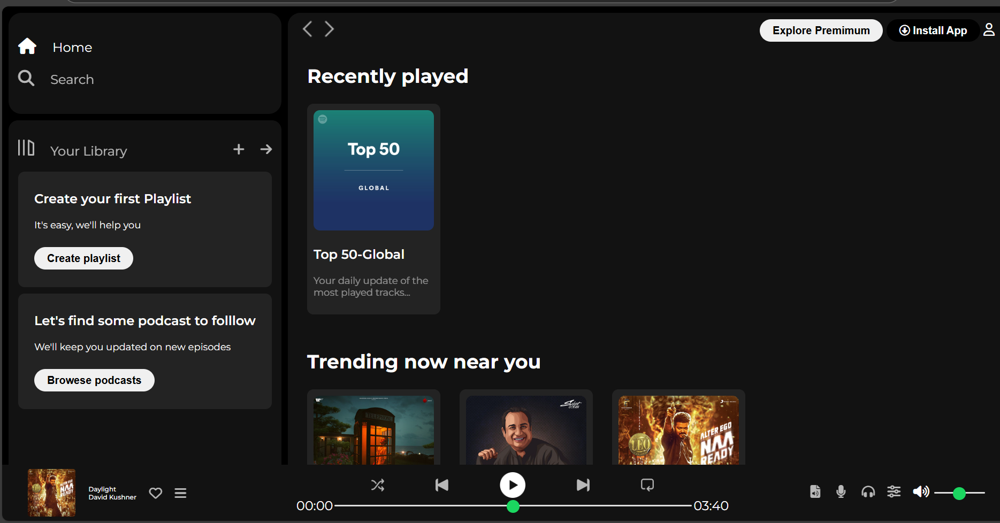

# 🎵 Spotify UI Clone

A simple static **Spotify-inspired UI clone** built using HTML and CSS. This project mimics the look and feel of the Spotify web app, showcasing modern layout, cards, and a mock music player.

##🌐 Live Demo
👉 [Click here to view the site](https://spotiffy-clone.onrender.com/)

## 📂 Project Structure
```
Sotiffy Clone/
│
├── index.html # Main HTML file
├── style.css # CSS styling
├── Assets/ # Contains images like card1img.jpeg, card4img.jpeg etc.
```

## 🚀 Features

- 🎶 Music card sections for Top 50, India Hits, etc.
- 📱 Responsive-ish layout with player UI
- 📷 Asset-based image and track styling
- 🎨 Custom styling with clean CSS classes (`main`, `card`, `music-player`, etc.)

## 🔧 Technologies Used

- HTML5
- CSS3

## 🖼️ Preview




## 📥 How to Use
- Clone this repository or download the ZIP.
- Open the index.html file in your browser.
- No need to run any server — it's a static website.

## 🧠 Learnings
- This project was made to:
- Practice layout design with CSS
- Use basic structure blocks like cards, sections, and image containers
- Understand how a music app layout can be constructed statically

## 📬 Contact
- Developed by Aditya Gadge
- Email: gadgeaditya099@gmail.com
